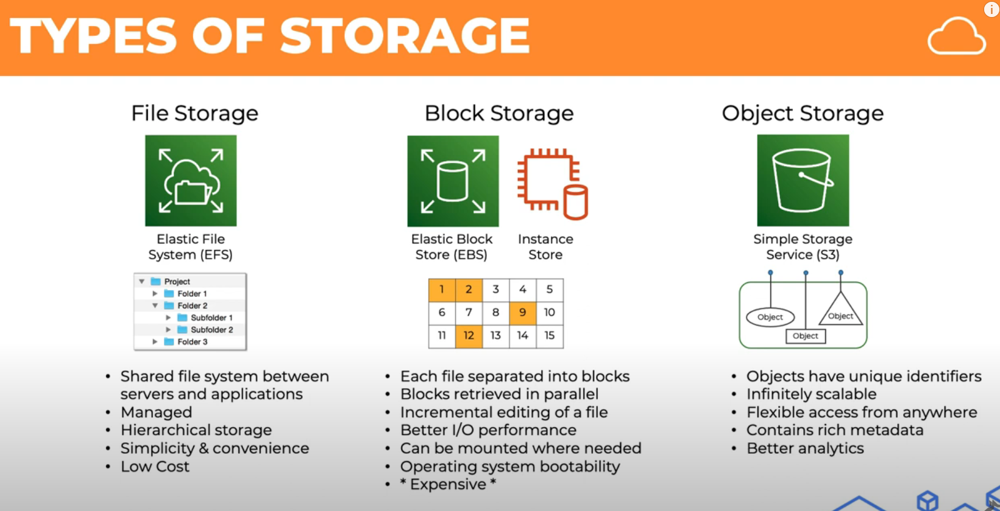

# File storage

Storage devices enble you to access your application and store data

There 3 types of storage:
- Block
- File level
- Object

 

## File level storage

It stores data in hierachical tree. Like a file system tree for easy access. 

The host of this can be a OS or dedicated file server such as Network attached storage (NAS). AWS EFS is also this. 

- Use case: first sharing & collaboration, archiving files.

## Block storage

It divides data into fixed-size blocks. This can be attached by using *Storage Area Network (SAN)*, and accessed by various protocols. AWS EBS is also this.

- Use case: Database, SQL, noSQL, add a file system on it can also do

## Object 

Some types of static data, e.g. image and video. It can save metadata for user access. AWS S3 is this.

- Use case: Video, music, big data analytics
