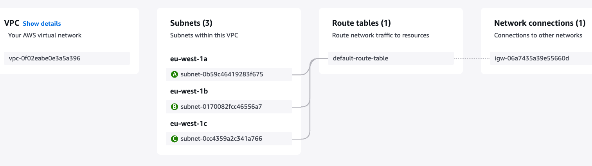

# VPC

In this VPC, there are 3 public subnets:

- eu-west-1a (public)
- eu-west-1b (public)
- eu-west-1c (public)

They are public because the Route tables

- `0.0.0.0` target: internet gateway
- `172.31.0.0/16` target: local

This route table has a route to internet gateway. If this route table attach to any subnet, that subnet will be public subnet.

The `172.31.0.0/16` means, any traffic in this VPC can route to local. It can be route to different subnet in same VPC.

---

In this VPC, there are 2 public and private subnets.

The subnet is private because there is not route to internet gateway.

Private subnets typically don't have direct internet access.

If private subnet set up a NAT, it can indirectly access the internet. However, the internet cannot access the private subnet. It is **one way** communication.